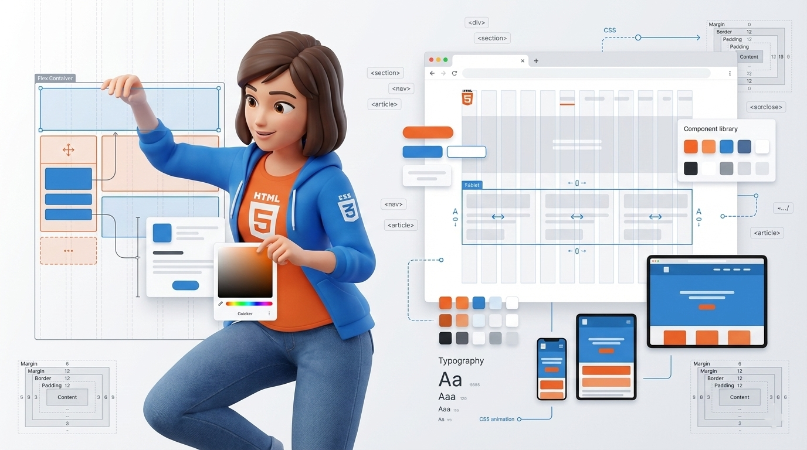

<h1 align="center">
  <br>
  HTML & CSS Playground 📗
  <br>
</h1>

<p align="center">
A hands-on HTML & CSS learning environment focused on layouts, responsive design, and UI components through practical examples.
</h3>

<div align="center">
  
</div

---

## 📦 Projects

<div align="center">

|                                                                                                   |                                                                                                     |
| :-----------------------------------------------------------------------------------------------: | :-------------------------------------------------------------------------------------------------: |
|      <div align="center"><br>01 - **[Basic Landing Page](./01-basic-landing-page) 🎨**</div>      |     <div align="center"><br>02 - **[Flexbox Landing Page](./02-flexbox-landing-page) 📐**</div>     |
|       <div align="center"><br>03 - **[Grid Landing Page](./03-grid-landing-page) 🔲**</div>       | <div align="center"><br>04 - **[Media Query Landing Page](./04-media-query-landing-page) 📱**</div> |
|  <div align="center"><br>05 - **[Advanced Image Gallery](./05-advanced-image-gallery) 🖼️**</div>  |         <div align="center"><br>06 - **[Parallax Webpage](./06-parallax-webpage) 🌄**</div>         |
|     <div align="center"><br>07 - **[Photography Website](./07-photography-website) 📷**</div>     |           <div align="center"><br>08 - **[Dribbble Clone](./08-Dribble-clone) 🎨**</div>            |
|      <div align="center"><br>09 - **[Parallax Webpage 2](./09-parallax-webpage-2) 🌅**</div>      |    <div align="center"><br>10 - **[Minimal Hero Sections](./10-minimal-hero-sections) 🖋️**</div>    |
|           <div align="center"><br>11 - **[Landing Pages](./11-landing-pages) 📜**</div>           |            <div align="center"><br>12 - **[Pricing Table](./12-pricing-table) 💲**</div>            |
| <div align="center"><br>13 - **[Branding Site (Tailwind)](./13-branding-site-tailwind) 🏷️**</div> |    <div align="center"><br>14 - **[Photography (Tailwind)](./14-Photography-tailwind) 📸**</div>    |

</div>

---

## 🤸 Installation

```bash
git clone https://github.com/soumadip-dev/HTML-CSS-Playground.git
cd HTML-CSS-Playground
```
